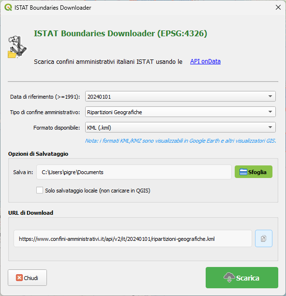

# ISTAT Boundaries Downloader - Plugin QGIS

## Descrizione
Un plugin QGIS per scaricare i confini amministrativi italiani forniti dall'ISTAT (Istituto Nazionale di Statistica) attraverso le API di onData. Consente di accedere facilmente ai dati geografici ufficiali delle divisioni amministrative italiane con differenti date di riferimento.

## Caratteristiche principali

- **Download di confini amministrativi italiani** in diversi formati (Shapefile, GeoPackage, CSV, KML, KMZ)
- **Selezione della data di riferimento** da un catalogo che va dal 1991 al 2024
- **Diverse tipologie di confini**:
  - Regioni
  - Province (Unità Territoriali Sovracomunali)
  - Comuni
  - Ripartizioni geografiche
- **Funzionalità di filtro avanzate**:
  - Filtro per regione (con possibilità di scaricare province o comuni della regione selezionata)
  - Filtro per provincia con campo di ricerca (con possibilità di scaricare comuni della provincia selezionata)
- **Caricamento automatico** dei dati scaricati in QGIS
- **Interfaccia semplice e intuitiva** con anteprima dell'URL di download
- **Copia URL negli appunti** per uso esterno
- **Barra di progresso** durante il download
- **Compatibilità universale** con QGIS versioni 3.16+ (supporto sia per Qt5 che Qt6)

## Novità nella versione 1.0.0
- **Supporto per formati KML e KMZ**: aggiunti i formati KML e KMZ per la visualizzazione in Google Earth e altri visualizzatori GIS
- **Compatibilità universale**: funziona sia con QGIS basato su Qt5 (versioni 3.16-3.22) che con QGIS basato su Qt6 (versioni 3.28+)
- **Miglioramenti all'interfaccia utente**: layout ottimizzato e messaggi informativi per i diversi formati
- **Gestione migliorata dei download**: barra di progresso più reattiva e gestione degli errori

## Installazione

1. Scarica il plugin come file ZIP
2. In QGIS, vai su **Plugin → Gestisci e installa plugin**
3. Seleziona la scheda **Installa da ZIP**
4. Sfoglia e seleziona il file ZIP scaricato
5. Clicca su **Installa plugin**

Dopo l'installazione, troverai l'icona del plugin nella barra degli strumenti di QGIS.

## Guida all'uso

### Interfaccia utente

Il plugin presenta un'interfaccia divisa in sezioni:

#### Selezione dei dati
- **Data di riferimento**: scegli la data per i confini (formato AAAAMMGG)
- **Tipo di confine**: seleziona il tipo di entità amministrativa da scaricare
- **Filtri**: quando applicabile, puoi filtrare per regione o provincia
- **Formato**: scegli tra Shapefile (.zip), GeoPackage (.gpkg), CSV (.csv), KML (.kml) o KMZ (.kmz)
  - Nota: I formati CSV contengono solo dati tabellari, senza geometrie
  - Nota: I formati KML/KMZ sono visualizzabili in Google Earth e altri visualizzatori GIS

#### Opzioni di salvataggio
- **Cartella di destinazione**: dove salvare i file scaricati
- **Solo salvataggio locale**: opzione per salvare i file senza caricarli automaticamente in QGIS

#### URL di download
Visualizza l'URL che sarà utilizzato per il download, con possibilità di copiarlo negli appunti.

### Procedura di download

1. Seleziona la data di riferimento desiderata
2. Scegli il tipo di confine amministrativo
3. Applica eventuali filtri per regione o provincia
4. Seleziona il formato di output
5. Imposta la cartella di destinazione
6. Clicca su "Scarica"

### Funzionalità avanzate

#### Filtro per regione
Quando selezioni "Regioni" come tipo di confine, puoi attivare il filtro per visualizzare:
- Province di una specifica regione
- Comuni di una specifica regione

#### Filtro per provincia
Quando selezioni "Province" come tipo di confine, puoi:
- Cercare una provincia specifica tramite il campo di ricerca
- Visualizzare un elenco ordinato di province con codice
- Scaricare solo i comuni appartenenti alla provincia selezionata

#### Estrazione automatica
- I file ZIP scaricati vengono automaticamente estratti nella cartella di destinazione
- Il plugin crea sottocartelle organizzate per tipo di confine e data

#### Utilizzo dei formati KML/KMZ
- I file KML possono essere visualizzati direttamente in QGIS e Google Earth
- I file KMZ sono una versione compressa del KML, ideale per condividere i dati
- Per utilizzare KMZ in Google Earth, basta trascinare il file nell'applicazione

## Requisiti di sistema
- QGIS 3.16 o successivo (compatibile sia con Qt5 che con Qt6)
- Connessione Internet per l'accesso alle API

## Compatibilità
- **QGIS 3.16-3.22**: Plugin funzionante con interfaccia basata su Qt5
- **QGIS 3.28 e successivi**: Plugin funzionante con interfaccia basata su Qt6

## Licenza
Questo plugin è rilasciato sotto licenza GPL v3.0.

## Crediti
- **Sviluppatore**: Totò Fiandaca
- **Email**: pigrecoinfinito@gmail.com
- **Dati**: forniti dalle API di [confini-amministrativi.it](https://www.confini-amministrativi.it/)
- **Repository**: [GitHub](https://github.com/ondata/confini-amministrativi-istat_qgis_plugin)

## Segnalazione problemi
Per segnalare bug o richiedere nuove funzionalità, visita la [pagina delle issues](https://github.com/ondata/confini-amministrativi-istat_qgis_plugin/issues) su GitHub.
